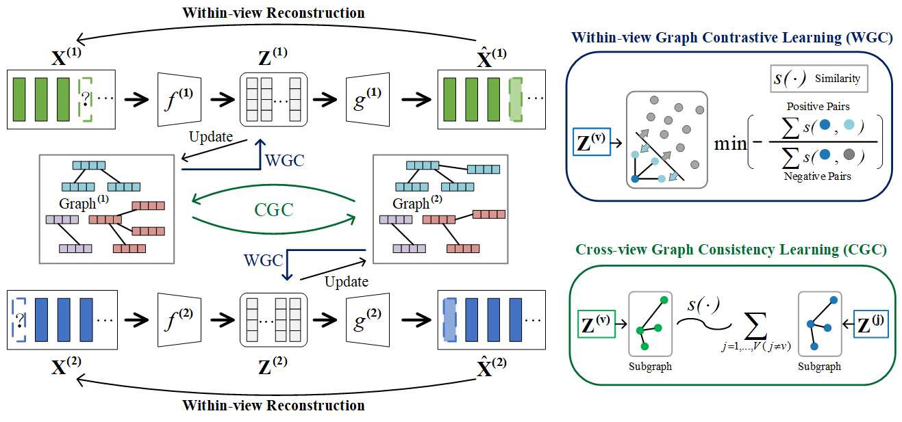

# Graph Contrastive Partial Multi-View Clustering

This repo contains the demo code and data of our IEEE TMM'2022 paper Graph Contrastive Partial Multi-View Clustering

>IEEE Xplore: [Graph Contrastive Partial Multi-View Clustering](https://ieeexplore.ieee.org/abstract/document/9904927)
>


## Dataset
data/COIL20/COIL20.mat

For the new dataset, you can use data/Incomplete_2view.py and data/Incomplete_multiview.py to construct partially missing data and calculate the neighboring samples required in the method through data/construct_graph.py.

## Reference
If you find our work useful in your research, please consider citing:

```latex
@ARTICLE{9904927,
  author={Wang, Yiming and Chang, Dongxia and Fu, Zhiqiang and Wen, Jie and Zhao, Yao},
  journal={IEEE Transactions on Multimedia}, 
  title={Graph Contrastive Partial Multi-View Clustering}, 
  year={2022},
  doi={10.1109/TMM.2022.3210376}}
